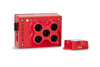
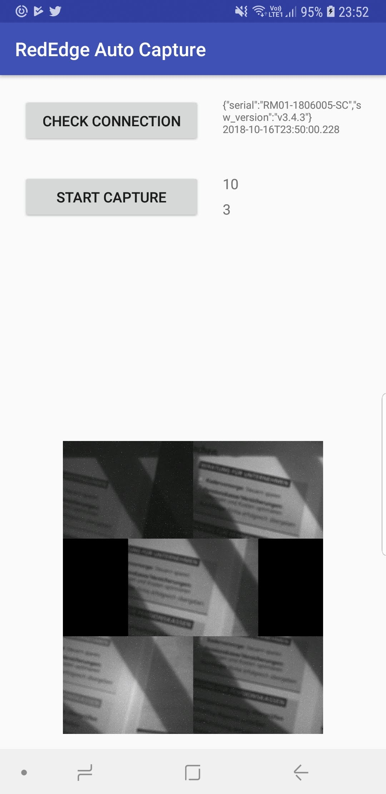

# Rededge-M timer based auto capture

If you use a heavy drone it is not possible to take pictures of the calibrated reflectance panel because to hold the drone and operate the webapp at the same time is impossible.
Going out for a mission means you have to have an additional person operating the webapp for capturing images while the other person is holding the drone. This increases the cost of a mission dramatically.
This android app solves the missing 'one man operation' feature of the webapp MicaSense provides on the Rededge-M.

## Current Version
In the current version the app starts a 10 second timer. During this 10 seconds you need to place the camera over the reflectance panel. After the 10 seconds are over
3 captures are taken from the revlectance panel.

# Roadmap

- Move the hardcode values into app settings
- Add QR Code detection based auto capture. This will allow to hold the camera over the reflectance panel. Once the QR Code is detected captures are taken.

# Supported Android Version
Version 8 is required but only because I wanted to us java.time classes. If you replace this with a jodatime implementation or simply use java Date it will work on lower versions.

# Compatibility

The code has been tested with:

- Samsung Galaxy Note 9 with Android Version 8.1
- MicaSense Rededge-M Firmware Version 3.4.3 

# License
Do what ever you like   
